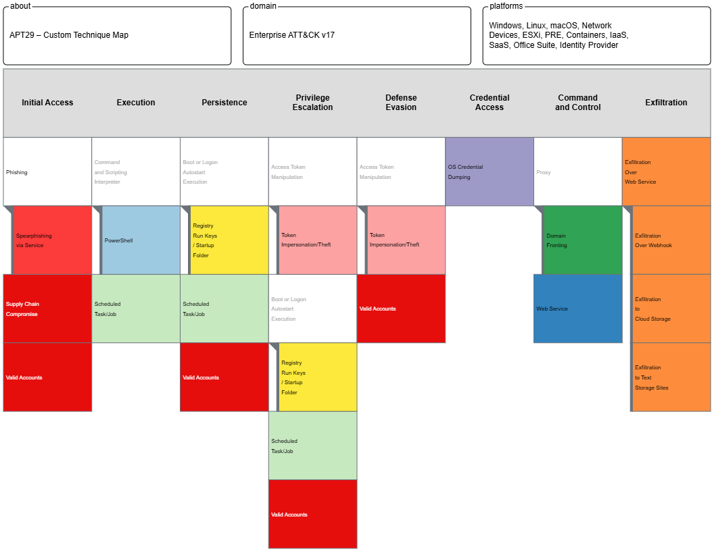

---

# APT29 Threat Actor Profile

---

## ➀ PROJECT OVERVIEW

This report provides a structured threat actor profile on APT29 (also known as Cozy Bear), a Russian state-sponsored group recognised for its stealth, operational discipline, and persistent targeting of government, diplomatic, and research entities.

The purpose of this project is to simulate the kind of threat intelligence output a junior SOC analyst might be expected to produce in a real-world environment. The report includes:

- A summary of APT29's background and activity
- Key tactics, techniques, and procedures (TTPs)
- Known campaigns and targets
- Indicators of compromise (IOCs)
- Mapping to the MITRE ATT&CK framework
- Defensive recommendations for detection and response

This profile is designed to support SOC teams by adding context to alerts, informing threat hunting activities, and strengthening analyst awareness of adversary behaviours.

---

## ➁ WHO IS APT29?

APT29, also known as Cozy Bear, is a Russian state-sponsored threat group attributed to Russia’s Foreign Intelligence Service (SVR). Active since at least 2008, APT29 has been linked to numerous cyber espionage campaigns targeting Western governments, research institutions, healthcare organisations, and think tanks.

The group is known for its strategic intelligence-gathering operations and disciplined, stealthy approach. APT29 prioritises access longevity and operational secrecy over disruption or destruction. Its campaigns typically align with Russia’s geopolitical objectives.

Aliases for APT29 include:
- The Dukes
- Nobelium
- UNC2452
- SVR
- CozyDuke
- Yttrium

APT29 came to international attention for its role in the 2020 SolarWinds supply chain compromise and continues to evolve its techniques across multiple attack surfaces.

APT29 operations are characterised by:
- Custom malware and tailored infrastructure
- Advanced spear-phishing campaigns
- Abuse of legitimate tools and services (e.g., OAuth, Microsoft 365 APIs)
- Persistent access through stealth and low detection rates

Understanding the intent and methods of APT29 is essential for modern defence teams seeking to prioritise detection and protect high-value targets.

---

## ➂ TACTICS, TECHNIQUES, AND PROCEDURES (TTPs)

APT29’s operations demonstrate a consistent emphasis on stealth, strategic access, and operational discipline. The group favours minimal malware, instead abusing legitimate tools, credentials, and services to evade detection and blend into normal activity.

The following techniques — mapped to the MITRE ATT&CK framework — reflect common patterns across multiple APT29 campaigns. These include phishing, cloud abuse, credential theft, and encrypted command-and-control channels.

<strong>Click to expand full list of tactics and techniques</strong>

 

### Initial Access
- **Spearphishing via Service** — T1566.003  
  Targeted phishing emails with links to credential harvesting pages or malware delivery.
- **Valid Accounts** — T1078  
  Use of stolen credentials to log into VPNs, cloud platforms, and email accounts.

### Execution
- **PowerShell Execution** — T1059.001  
  Commands and payloads run via built-in Windows scripting tools.
- **Scheduled Task/Job** — T1053  
  Tasks scheduled for persistence or delayed execution of payloads.

### Persistence
- **Registry Run Keys / Startup Folder** — T1547.001  
  Registry edits used to maintain access after reboot.
- **Application Layer Protocol – HTTPS** — T1071.001  
  Encrypted HTTPS traffic used to blend C2 with legitimate traffic.

### Credential Access
- **Credential Dumping** — T1003  
  Dumping credentials from LSASS or Security Accounts Manager (SAM) database.
- **Token Impersonation** — T1134.001  
  Abusing OAuth tokens or access tokens to impersonate users in cloud environments.

### Command and Control
- **Web Service (C2)** — T1102  
  Using cloud services, blogs, and shared drives to route command and control.
- **Domain Fronting** — T1090.004  
  Hiding real C2 infrastructure behind trusted domains.

### Exfiltration
- **Exfiltration Over Web Services** — T1567.002  
  Data is exfiltrated through HTTPS or cloud apps like OneDrive and Dropbox.

> **Analyst Note:**  
> These techniques reveal how APT29 achieves long-term access by prioritising stealth over brute force. The use of built-in tools, compromised credentials, and encrypted channels makes traditional IOC-based detection difficult. Mapping these behaviours to MITRE ATT&CK helps defenders shift toward behaviour-driven detection and hunt strategies.

---

## ➃ KNOWN CAMPAIGNS

APT29 has been attributed to several high-impact cyber espionage campaigns. These operations reflect the group’s strategic focus on intelligence gathering, long-term access, and stealthy intrusion methods.

<strong>Click to view detailed summaries of major APT29 campaigns</strong>

 

### SolarWinds Supply Chain Compromise (2020)

**Summary:**  
APT29 (tracked as UNC2452/Nobelium) compromised the build environment of SolarWinds' Orion platform. They inserted a backdoor (SUNBURST) into legitimate software updates, which were then distributed to over 18,000 customers.

**Target:**  
U.S. federal agencies, global IT firms, think tanks

**Initial Access:**  
Trojanised updates delivered via SolarWinds’ software supply chain

**Tactics Observed:**  
- Supply Chain Compromise – T1195.002  
- Command and Control via HTTPS – T1071.001  
- Credential Access and Lateral Movement  
- Use of the SUNBURST and TEARDROP malware families

**Outcome:**  
Long-term, covert access to sensitive systems across U.S. infrastructure. Prompted global reviews of supply chain security.

**Reference:**  
[FireEye Analysis](https://www.fireeye.com/blog/threat-research/2020/12/evasive-attacker-leverages-solarwinds-supply-chain-compromises-with-sunburst-backdoor.html)

---

### COVID-19 Vaccine Espionage Campaign (2020)

**Summary:**  
APT29 targeted academic and healthcare organisations involved in COVID-19 vaccine development. Spearphishing emails and custom malware (WellMess, WellMail) were used to attempt data theft.

**Target:**  
Pharmaceutical firms, universities, and research labs in the US, UK, and Canada

**Initial Access:**  
Spearphishing and credential harvesting

**Tactics Observed:**  
- Spearphishing via Service – T1566.003  
- Use of custom malware (WellMess, WellMail)  
- Credential Theft and Privilege Escalation

**Outcome:**  
Revealed the risk of state-sponsored espionage during a global health crisis. Attribution led to coordinated public advisories from multiple countries.

**Reference:**  
[UK NCSC Advisory](https://www.ncsc.gov.uk/news/advisory-apt29-targets-covid-19-vaccine-development)

---

## ➄ INDICATORS OF COMPROMISE (IOCs)

APT29 campaigns have produced a range of observable artefacts — known as Indicators of Compromise — which can be used to detect or investigate their activity. These include IP addresses, domains, file hashes, and registry paths.

The following are example IOCs associated with past APT29 operations. These values should be treated as historical references and validated before use in any live detection pipeline.

<strong>Click to view sample IOCs</strong>

 

| Type     | Value                            | Context / Description                         |
|----------|----------------------------------|-----------------------------------------------|
| Domain   | `login-microsoft-secure[.]com`   | Credential harvesting domain (WellMess C2)    |
| Domain   | `cloudsync-update[.]net`         | Likely used for C2 communication              |
| IP       | `185.225.69.69`                  | Identified C2 infrastructure (WellMail)       |
| IP       | `104.248.120.232`                | Historical C2 server                          |
| SHA256   | `e3b0c44298fc1c149afbf4c8996fb924...` | SUNBURST dropper sample hash                  |
| SHA1     | `af4edbf1cfc09485b50e5a683eb9d93df38dc437` | Linked to credential harvesting payload       |

> **Analyst Note:**  
> IOCs are context-sensitive and often time-limited. Use them alongside behavioural analytics, TTPs, and log correlation for effective detection. When possible, prioritise mapping IOCs to observed techniques (e.g., MITRE) rather than relying on standalone indicators.

---

## ➅ MITRE ATT&CK MAPPING

APT29’s tactics and techniques align with a broad set of MITRE ATT&CK entries across multiple phases of the intrusion lifecycle. Mapping their known behaviours to the MITRE framework supports defenders in building proactive detection rules, assessing threat coverage, and improving response strategies.

The following table outlines key techniques attributed to APT29, grouped by attack phase.

| Tactic              | Technique                                | MITRE ID      |
|---------------------|-------------------------------------------|---------------|
| Initial Access       | Spearphishing via Service                | T1566.003      |
| Initial Access       | Valid Accounts                          | T1078          |
| Execution            | PowerShell                              | T1059.001      |
| Persistence          | Scheduled Task/Job                      | T1053          |
| Persistence          | Registry Run Keys / Startup Folder      | T1547.001      |
| Credential Access    | Credential Dumping                      | T1003          |
| Credential Access    | Token Impersonation                     | T1134.001      |
| Command & Control    | Web Service                             | T1102          |
| Command & Control    | Domain Fronting                         | T1090.004      |
| Exfiltration         | Exfiltration Over Web Services          | T1567.002      |
| Supply Chain         | Compromise of Software Supply Chain     | T1195.002      |

> **Analyst Note:**  
> Mapping adversary behaviour to MITRE techniques gives SOC teams a common language for threat analysis and detection. Unlike IOCs, which can quickly expire or be changed, TTPs provide behavioural insights that remain more stable over time. This allows detection engineers to focus on “how” the threat operates, not just “what” it uses.

---

## ➆ DETECTION STRATEGIES & RECOMMENDATIONS

Based on APT29’s observed tradecraft, the following recommendations are designed to help SOC teams strengthen detection and response capabilities.

### Initial Access
- Deploy email filters to catch spearphishing attempts, especially those with embedded links or file attachments
- Flag logins from new locations, unusual devices, or impossible travel events, particularly for privileged accounts

### Credential Access
- Detect access to LSASS memory and tools commonly used for credential dumping
- Monitor unusual OAuth token use in cloud environments such as Microsoft 365

### Persistence
- Alert on creation or modification of scheduled tasks, particularly those running unsigned binaries
- Monitor changes to Windows registry keys often used for persistence (e.g., `HKCU\Software\Microsoft\Windows\CurrentVersion\Run`)

### Command and Control
- Inspect beacon-like outbound traffic patterns to uncommon or unclassified domains over HTTPS
- Identify potential domain fronting activity using traffic analysis and TLS SNI inspection

### Exfiltration
- Detect large or unusual outbound data transfers to cloud storage services (e.g., OneDrive, Dropbox)
- Correlate exfiltration behaviour with prior internal reconnaissance or privilege escalation activity

### Strategic Recommendations
- Align detection content and SIEM rules to MITRE ATT&CK techniques to enable technique-based alerting
- Conduct proactive threat hunts using known APT29 TTPs rather than relying solely on IOCs

> **Analyst Note:**  
> These recommendations emphasise behavioural detection over static indicators. APT29 frequently shifts infrastructure and payloads, making IOC-only defences fragile. A technique-focused approach offers better long-term coverage and resilience.

---

## ➇ VISUAL TECHNIQUE MAP

The following image presents a custom MITRE ATT&CK mapping for APT29, visually highlighting key techniques observed across different stages of the intrusion lifecycle. This was created using the MITRE ATT&CK Navigator and tailored to match techniques discussed in this profile.

> **Analyst Note:**  
> This custom visual highlights select techniques attributed to APT29 across campaigns like SolarWinds and COVID-19 vaccine espionage. Colour-coded tactics help illustrate the attack flow and operational emphasis of this adversary. While not exhaustive, it offers a practical reference point for detection engineering and adversary emulation.

---

## ➈ SOC HARDENING SUMMARY

APT29 prioritises stealth, credential theft, and long-term access. Defenders should consider detection engineering and hardening controls that map to their known TTPs.

| Category               | Recommendation                                                                 |
|------------------------|----------------------------------------------------------------------------------|
| Email Security         | Deploy advanced phishing protection with sandboxing and link detonation.       |
| Identity & Access      | Monitor for unusual MFA bypasses, OAuth abuse, and anomalous cloud logins.     |
| Credential Protection  | Enable LSASS protection, block cleartext credentials, and audit token usage.   |
| Endpoint Detection     | Deploy EDR capable of detecting PowerShell misuse and registry persistence.    |
| Threat Hunting         | Hunt for use of domain fronting, suspicious scheduled tasks, and unusual C2.   |
| Logging & Telemetry    | Ensure coverage of Windows Event Logs, cloud auth logs, and command execution. |
| User Behaviour         | Baseline privileged user behaviour; investigate anomalies in 365/OAuth usage.  |
| MITRE Coverage         | Prioritise detection for T1078, T1566.003, T1059.001, and T1003 techniques.     |

> **Analyst Note:**  
> Defensive planning against APT29 should focus less on malware signatures and more on **behavioural patterns** — particularly credential theft, API abuse, and stealthy persistence. Mapping defences to ATT&CK techniques strengthens long-term detection posture.

---

## ➉ FINAL REFLECTION & TAKEAWAYS

This project challenged me to think like a threat intelligence analyst while building structured documentation that could realistically support SOC operations. What began as a simple actor profile evolved into a deeper exercise in research, technical mapping, and visual storytelling.

I learned to:
- Identify and validate TTPs from multiple public sources
- Use the MITRE ATT&CK Navigator to visualise threat behaviour
- Translate raw intelligence into actionable detection insights
- Maintain clarity and structure in a recruiter-facing README

The hardest part was mapping techniques precisely — understanding sub-techniques and ensuring accuracy required me to revisit MITRE's documentation multiple times. It taught me that **good detection relies on nuance**, not just labels.

Going forward, I’d like to:
- Explore more actors and compare their TTP overlap
- Build detection rules (e.g., Sigma) for some mapped behaviours
- Include custom threat hunt queries and detection gaps

> **Analyst Note:**  
> APT29 taught me the value of patience, stealth, and operational maturity in adversary behaviour. This profile helped me practise not just how to observe threats — but how to communicate them clearly to others.

---

---

## Sources & References

- https://attack.mitre.org/groups/G0016/
- https://www.fireeye.com/blog/threat-research/2020/12/evasive-attacker-leverages-solarwinds-supply-chain-compromises-with-sunburst-backdoor.html
- https://www.ncsc.gov.uk/news/advisory-apt29-targets-covid-19-vaccine-development
- https://www.microsoft.com/en-us/security/blog/2021/10/25/nobelium-returning-to-target-governments/

## Let’s Connect

**Hussien Kofi**  
Aspiring SOC Analyst | Threat-Informed | Detection-Focused 

**This project is part of a practical cybersecurity portfolio focused on entry-level SOC analyst skills — including adversary profiling, MITRE ATT&CK mapping, IOC analysis, and visual threat intelligence.**

📧 [Email](mailto:Hussienkofi@gmail.com)  
🔗 [LinkedIn](https://www.linkedin.com/in/hussien-kofi-99a012330/)  
💻 [GitHub](https://github.com/Hussien-K11)

